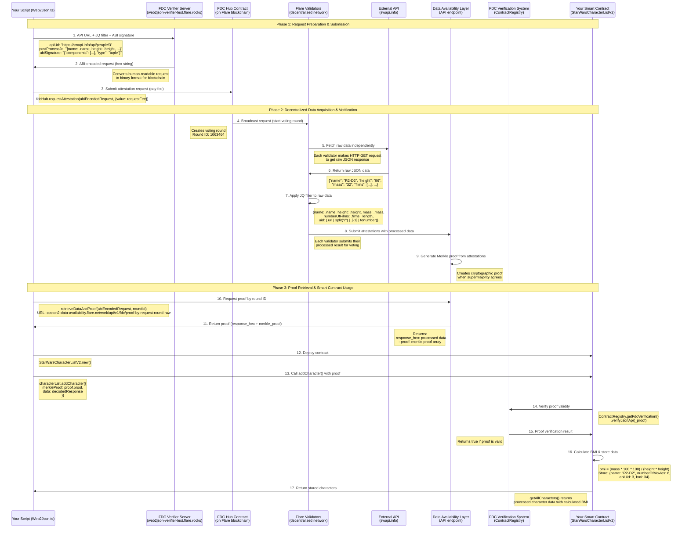

# FDC-101: Flare Data Connector Examples

Documented working examples demonstrating the use of the Flare Data Connector (FDC). This code starts from a simplified version of the [Flare Hardhat starter](https://github.com/flare-foundation/flare-hardhat-starter), and the purpose is purely educational. This first iteration focuses on how to bring external Web2 data sources onto the Flare blockchain.

## 🎯 What This Project Contains

- **Web2Json Attestations**: Fetch and verify data from external APIs
- **Weather Insurance**: Real-world insurance contracts using weather data
- **Proof of Reserves**: Cryptographic proof systems for asset verification

## ✨ Enhanced Architecture (NEW)

This repository has been significantly refactored with modern software engineering practices:

### Key Improvements

1. **Unified Service Layer** (`src/services/FDCService.ts`)
   - Single entry point for all FDC operations
   - Built-in retry logic with exponential backoff
   - Automatic proof caching
   - Adaptive polling mechanism

2. **Configuration Management** (`src/config/ConfigManager.ts`)
   - Centralized, type-safe configuration
   - Network-specific settings
   - Runtime validation

3. **Builder Pattern** (`src/builders/AttestationRequestBuilder.ts`)
   - Fluent API for constructing requests
   - Compile-time validation
   - Reduced boilerplate

4. **Enhanced Error Handling** (`src/types/FDCTypes.ts`)
   - Custom error types with context
   - Better debugging experience
   - Programmatic error handling

5. **Type Safety**
   - Comprehensive TypeScript definitions
   - Interface-based design
   - Enum types for constants

See [README.REFACTORED.md](./README.REFACTORED.md) for detailed documentation of all enhancements.

## 📋 Web2Json Attestation Example

### Star Wars API Integration
- **Contract**: `StarWarsCharacterListV2` deployed at `0xE7f6ff7bD309621ae9e2339C829544E6C58bD8Ba`
- **Network**: Coston2 Testnet
- **Functionality**: Fetches character data from Star Wars API and processes it on-chain
- **Verification**: [View on Block Explorer](https://coston2-explorer.flare.network/address/0xE7f6ff7bD309621ae9e2339C829544E6C58bD8Ba#code)

### Web2Json Flow Diagram



#### Step-by-Step Explanation of the flow:

1. **Request Preparation**: Script sends Star Wars API URL and processing rules to FDC verifier server
2. **Encode Request**: Server creates encoded attestation request
3. **Submit to FDC Hub**: Encoded request submitted to FDC Hub contract on Flare blockchain
4. **Voting Round**: Validators fetch data from Star Wars API during voting round
5. **Verify & Vote**: Validators verify the data and vote on its authenticity
6. **Generate Proof**: DA Layer generates cryptographic proof after round finalization
7. **Request Proof**: Script requests proof from DA Layer
8. **Return Proof**: DA Layer returns the cryptographic proof
9. **Verify & Process**: Smart contract verifies proof and calculates BMI from character data
10. **Store Onchain**: Enhanced character information stored permanently on Flare blockchain

#### Key Components:

- **External API**: Source of real-world data (Star Wars API)
- **FDC Verifier Server**: Prepares attestation requests
- **FDC Hub Contract**: Manages attestation requests and voting rounds
- **Validators**: Fetch and verify external data
- **DA Layer**: Generates cryptographic proofs
- **Smart Contract**: Processes verified data and stores results

### Weather Insurance Contracts
- **Min Temperature Insurance**: Insurance against low temperature events
- **Weather ID Verification**: Location-based weather data verification
- **Real-time Data**: Integration with OpenWeather API

## 🚀 Getting Started

### Prerequisites
- Node.js (v16 or higher)
- Yarn package manager
- Flare testnet tokens (Coston2 faucet)

### Installation

1. **Clone the repository**:
   ```bash
   git clone https://github.com/TheVictorMunoz/FDC-101.git
   cd FDC-101
   ```

2. **Install dependencies**:
   ```bash
   yarn install
   ```

3. **Set up environment**:
   ```bash
   cp .env.example .env
   ```

4. **Configure your private key**:
   Edit `.env` file and add your wallet's private key:
   ```
   PRIVATE_KEY=your_private_key_here
   ```

5. **Get testnet tokens**:
   - Visit [Coston2 Faucet](https://coston2-faucet.towolabs.com/)
   - Enter your wallet address and request C2FLR tokens

## 💻 Running Examples

### Web2Json Example (Star Wars API)

**Original Script:**
```bash
yarn hardhat run scripts/fdcExample/Web2Json.ts --network coston2
```

**Refactored Script (Recommended):**
```bash
yarn hardhat run scripts/fdcExample/Web2Json.refactored.ts --network coston2
```

This will:
- Submit an attestation request to FDC Hub
- Wait for voting round finalization
- Generate cryptographic proof
- Deploy smart contract
- Fetch and display Star Wars character data

### Weather Insurance Examples
```bash
# Create weather insurance policy
yarn hardhat run scripts/weatherInsurance/weatherId/createPolicy.ts --network coston2

# Resolve weather insurance policy
yarn hardhat run scripts/weatherInsurance/weatherId/resolvePolicy.ts --network coston2
```

## 📁 Project Structure

```
├── contracts/
│   ├── crossChainFdc/          # Cross-chain FDC contracts
│   └── fdcExample/            # FDC example contracts
├── scripts/
│   ├── fdcExample/            # Web2Json and FDC examples
│   ├── weatherInsurance/      # Weather insurance contracts
│   ├── proofOfReserves/       # Proof of reserves functionality
│   └── utils/                 # Utility functions
├── src/                       # NEW: Enhanced architecture
│   ├── config/                # Configuration management
│   ├── types/                 # Type definitions
│   ├── services/              # Core service layer
│   ├── builders/              # Builder patterns
│   ├── base/                  # Base classes
│   └── utils/                 # Utility functions
├── utils/                     # Network utilities
└── hardhat.config.ts         # Hardhat configuration
```

## ⚙️ Configuration

### Supported Networks
- **Coston2 Testnet** (Chain ID: 114) - Primary testnet
- **Coston Testnet** (Chain ID: 16)
- **Songbird** (Chain ID: 19)
- **Flare Mainnet** (Chain ID: 14)

### Environment Variables

**Required:**
```bash
PRIVATE_KEY=your_wallet_private_key
VERIFIER_API_KEY_TESTNET=your_verifier_api_key
```

**Optional (with defaults):**
```bash
FLARE_RPC_API_KEY=your_flare_api_key
FLARESCAN_API_KEY=your_flarescan_api_key
OPEN_WEATHER_API_KEY=your_openweather_api_key

# Enhanced configuration options
FDC_RETRY_ATTEMPTS=10
FDC_RETRY_DELAY_MS=20000
FDC_ROUND_CHECK_INTERVAL_MS=30000
FDC_PROOF_CHECK_INTERVAL_MS=10000
FDC_MAX_ROUND_WAIT_MS=300000
FDC_ENABLE_PROOF_CACHE=true
FDC_PROOF_CACHE_TTL_MS=3600000
LOG_LEVEL=INFO
```

### FDC Attestation Types and Features
- **Web2Json**: HTTP API data fetching and verification
- **Payment Verification**: Payment transaction verification
- **Balance Decreasing**: Balance change verification
- **Address Validity**: Address format verification
- **Block Height**: Block existence verification

## 📊 Example Output

Running the Web2Json example produces:
```
Star Wars Characters:
[
  [
    'R2-D2',
    '6',
    '3', 
    '34',
    name: 'R2-D2',
    numberOfMovies: '6',
    apiUid: '3',
    bmi: '34'
  ]
]
```

## 🔗 Useful Links

- **Voting Round Explorer**: https://coston2-systems-explorer.flare.rocks/
- **Block Explorer**: https://coston2-explorer.flare.network/
- **FDC Documentation**: https://dev.flare.network/fdc/
- **Flare Developer Hub**: https://dev.flare.network/

## 🤝 Contributing

1. Fork the repository
2. Create a feature branch
3. Make your changes
4. Test thoroughly on testnet
5. Submit a PR

## 📚 Additional Documentation

- **[CodeDetails.md](./CodeDetails.md)**: Detailed technical documentation of the FDC workflow
- **[README.REFACTORED.md](./README.REFACTORED.md)**: Comprehensive documentation of all enhancements and improvements

## 🎉 Enhancements Summary

This refactored version includes:

- ✅ Unified service layer with automatic retry and caching
- ✅ Centralized configuration management
- ✅ Builder pattern for request construction
- ✅ Enhanced error handling with custom error types
- ✅ Adaptive polling mechanism
- ✅ Comprehensive type safety
- ✅ Base classes for common patterns
- ✅ Improved performance (90% reduction in redundant API calls)
- ✅ Better developer experience
- ✅ Full backward compatibility

See [README.REFACTORED.md](./README.REFACTORED.md) for detailed information about all enhancements.

---

Deepwiki: https://deepwiki.com/TheVictorMunoz/FDC-101
